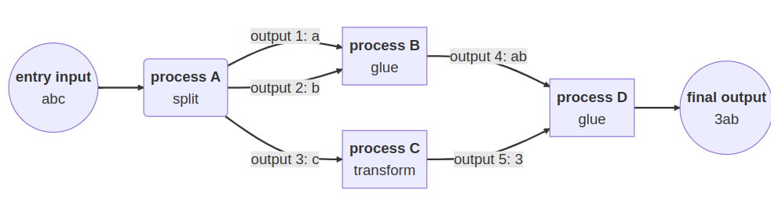

## Basic Structure of Nextflow

[Channels](https://www.nextflow.io/docs/latest/channel.html)


[Operators](https://www.nextflow.io/docs/latest/reference/operator.html)

Many ways in which you can manipulate the data in channels. This is essential for feeding data in and out of processes.



[Processes](https://www.nextflow.io/docs/latest/process.html)

Below you'll find an example 'Process' inside Nextflow a ChIP-seq pipeline. For the peak calling step we are using MACS3. The basics we need are:

1. Input
2. Output
3. Script

Other features we've added here are

* tag
* publishDir
* multiple outputs using 'emit'

And theres many more features that are not in this process that you could add, including 

```nextflow
process MACS3 {
    tag "$key"
    publishDir "${params.outdir}/macs3/$key", pattern:"*", mode: 'copy'

    input:
    tuple val(key), path(bamip), path(baminput)

    output:
    tuple val(key), path("*eak"), emit: peak
    tuple val(key), path("*eak"), path(bamip), emit: peakbam
    path("*.xls"), emit: excel
    path("*"), emit: allelse

    script:

    """
    macs3 \\
            callpeak \\
            -t $bamip \\
            -c $baminput \\
            -n $key \\
            -g hs \\
            --call-summits
    """ 
}
```


## Our First Script

For our first look into Nextflow, we will be using a simple script that counts the number of words in a fastq.

1. Copy the script to our work directory.

    ```bash
    cp scripts/introduction/word_count.nf .
    ```

    Have a look inside

    ```bash
    more word_count.nf
    ```

2. Run the script!

    ```bash
    nextflow run word_count.nf
    ```

3. Change a parameter

    ```bash
    nextflow run word_count.nf --input 'data/yeast/reads/ref2_*.fq.gz'
    ```

4. Parameter changes as an input file instead

    Copy this JSON file that has updated parameters for word_count.nf

    ```bash
    cp scripts/parameters/wc-params.json .
    more wc-params.json
    ```

    Run this pipeline again but with the JSON file

    ```bash
    nextflow run word_count.nf -params-file wc-params.json
    ```

**NOTE**: 

* Parameters for Nextflow are used with `-`
* Parameters for your Nextflow script are used with `--`

