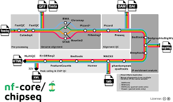

## What is a pipeline?

A system where data comes in and data goes out the end. We use the term pipeline to describe a bunch of bioinformatics tools grouped together in an automated way that passes data along a chain. This can be a bash script, or using a more dedicated language for the task such as **Nextflow** or **Snakemake**. Today we will learn Nextflow.

## What is Nextflow?

[Nextflow](https://www.nextflow.io/) is a system that allows you to join together bash commands in a way that is reproducible and portable. It's a commonly used method of doing Bioinformatics used in both industry and academia. It puts a lot of focus on reproducibility as it works hand-in-hand with other systems such as Git and Singularity/ Docker so a bunch of people can work on these pipelines together with a portable set of software. 

Here's an example ChIP-seq Nextflow pipeline from [nf-core](https://nf-co.re/), 

## Why use Nextflow instead of just a bash script?

The answer is that Nextflow adds a ton of features that allow you to make your pipelines more complex with less code. A few of these features are:

* Ability to run all your samples *in parallel* - this is the coolest feature as it makes it run really fast (provided you have enough computational resources). 
* If you re-run a pipeline, Nextflow will check what has changed, be it in the script or in the input data. All that is the same will not be re-run. This allows you to continuously test your pipeline as you add new processes without re-running the entire pipeline everytime. Plus if you have a new replicate, it won't re-run all your other replicates.
* Integrates the use of Docker/ Singularity. Containerized software makes like a lot easier. 

## Today

Although there are a lot of Nextflow pipelines already out there to use, today we are going to make some from scratch! The ability to create your own pipelines will help you in whatever analysis you like to do. Plus if you look up jobs in bioinformatics online almost every one looks for this skill.

Like all scripts, the complexity of a Nextflow script is completely up to you. So after this class be sure to try incorporate it into your own research and build custom pipelines that you and your lab can use!

Today we will start off with some basic commands in nextflow and then build up.